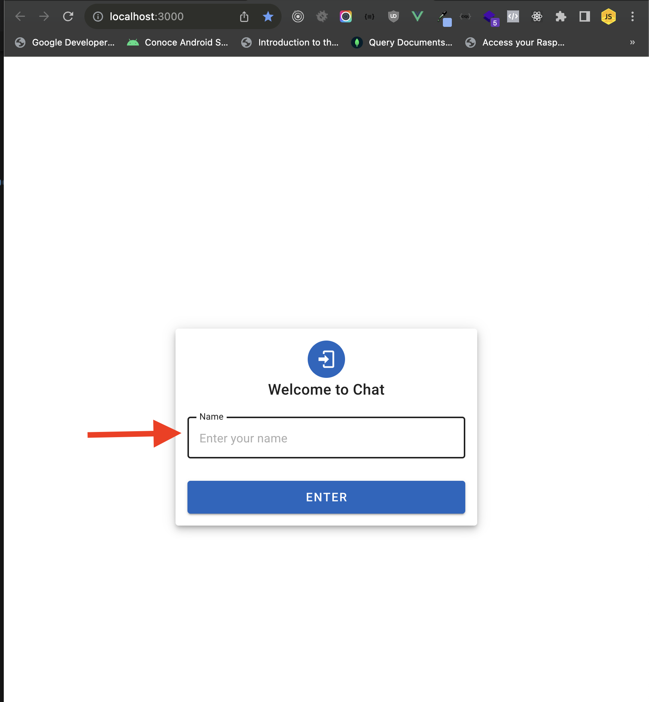
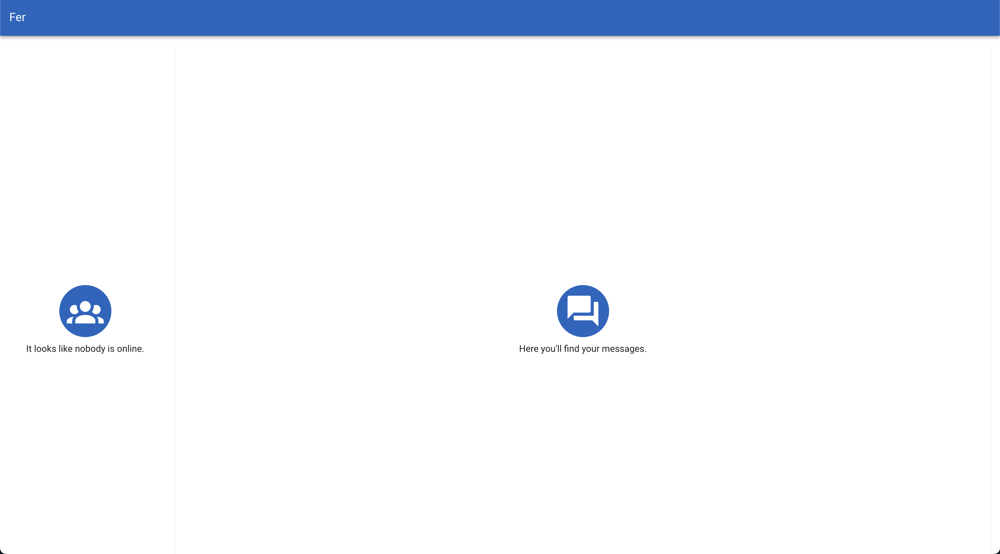
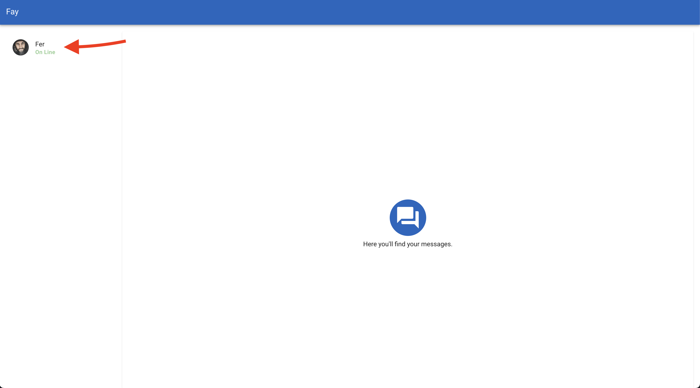
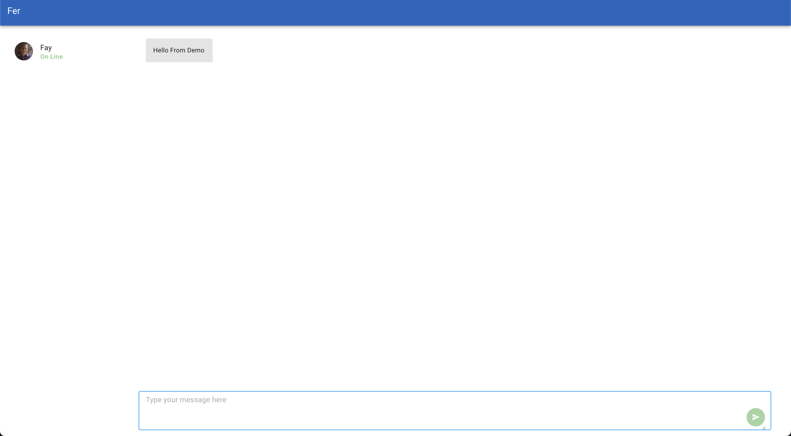
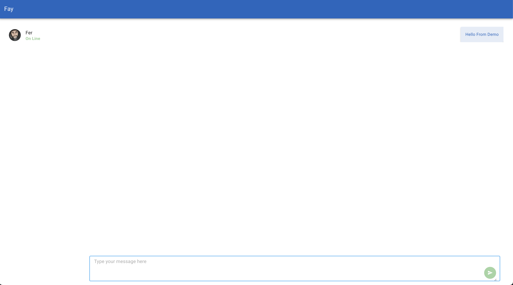

# Chat Demo

### Installation

#### Clone the project
```bash
git clone https://github.com/DevelopFer/chat-demo.git
```

#### Enter the folder
```bash
cd chat-demo
```

#### Install server dependencies
```bash
npm run install-server
```

#### Install app dependencies
```bash
npm run install-app
```

## .env File
#### Make sure .env file exists and contains.required values. You can leave port 3000 for the front app.
```bash
DB_HOST="0.0.0.0:27017" #mongo connection
DB=socket_test #database name
APP_FRONT_END=http://localhost:3000 #use port 3000
```

From the root folder run
```bash
npm run dev
```

Opent another terminal, enter the app folder and run the front end app
```bash
cd app && npm run dev
```


### How to use the chat
Access http://localhost:3000 and enter a name


You'll be redirected to the general chat view


Open another tab and enter a name. Once in the chat view a list of online users is shown. Click on the user element


Start chatting

